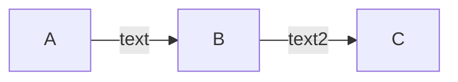
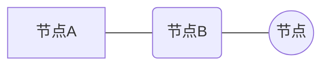
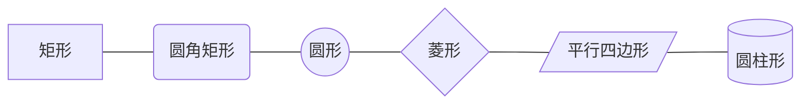
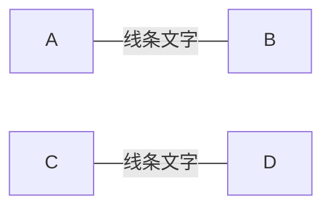
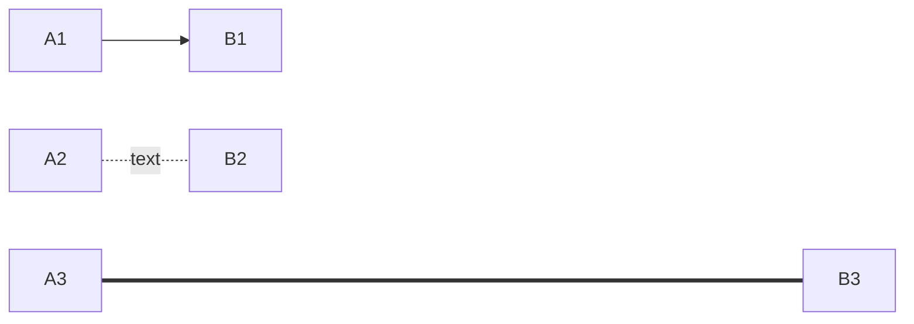
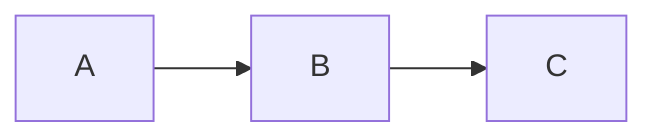
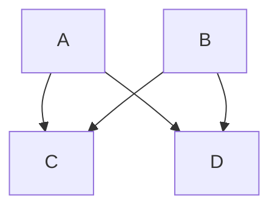
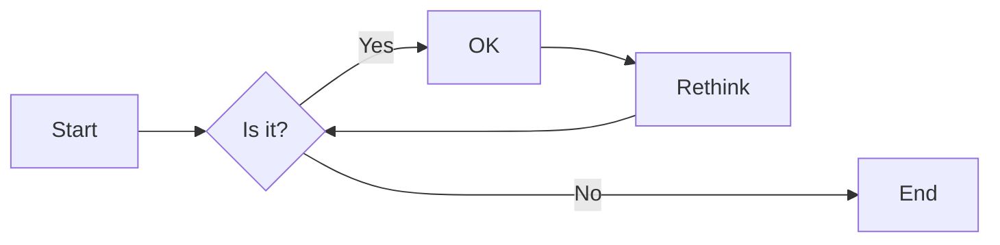

# 3. mermaid绘图

## 简介

mermaid[^1]是一个mardown画图插件。让您能够使用代码画图。包括

1. 流程图
2. 类图
3. 实体关系图
4. ...

值得注意的是，mermaid并不是markdown基础语法，这意味着并不是所有markdown编辑器都能渲染出来，以下列举几个能够渲染mermaid编辑器

1. Typora[^2]（没收费之前我愿称其为宇宙最强md编辑器）
2. MarkText[^3]（对标typora的开源md编辑器）
3. Markdown Preview Enhanced（VS Code插件）
4. markdown-preview-enhanced（Atom插件）

## 基础语法

mermaid使用的是markdown中的代码块语法，绘图代码要包裹在代码块中，如下

````md

````

上述代码会渲染出如下图形


## Flowchart（流程图）

### 概览

流程图其实就是由一些线条（link）将一堆节点（node）组合起来的图形

* node: 可以添加文字，也可以定义形状（方形 ，圆形，圆角矩形等）
* link: 可以添加文字，定义长度和形状（实线，虚线，带不带箭头等）

### 方向

```md
flowchart LR
    Start --> Stop
```


上述例子中的`LR`决定了整张图的方向，下面介绍一下几种方向的写法

* TB - top to bottom
* TD - top-down/ same as top to bottom
* BT - bottom to top
* RL - right to left
* LR - left to right

### 节点-node

#### 添加文字

下述代码可以生成一个带有文字的节点

```md
flowchart LR
    id[节点名称]
```


#### 修改形状

包裹节点名称的一对符号决定了节点的形状，具体看下面代码

```md
flowchart LR
    A[节点A] --- B(节点B) -- C((节点))
```



这里给出几种常用形状的写法，mermaid官方文档[^1]中有更多形状的写法

```md
flowchart LR
    A[矩形] --- B(圆角矩形) --- C((圆形)) --- D{菱形} --- E[/平行四边形/] --- F[(圆柱形)]
```



### 线条-link

#### 添加文字

有两种给线条添加文字的语法

```md
flowchart LR
    A --线条文字--- B
    C ---|线条文字|D
```



注意，第一种写法，文字左边的符号数至少两个，右边符号至少三个，可以为更多

```md
flowchart LR
    A --线条文字-- B  # 这样是不行的
    A ---线条文字-- B # 这样也是不行的
```

个人觉得第一种写法更形象，更容易记忆

#### 修改样式

线条的样式分为形状和长度，下面给出一张表格（在官方文档[^1]中能发现更多样式）

| Length            | 1      | 2       | 3        |
| :---------------- | :----- | :------ | :------- |
| Normal            | `---`  | `----`  | `-----`  |
| Normal with arrow | `-->`  | `--->`  | `---->`  |
| Thick             | `===`  | `====`  | `=====`  |
| Thick with arrow  | `==>`  | `===>`  | `====>`  |
| Dotted            | `-.-`  | `-..-`  | `-...-`  |
| Dotted with arrow | `-.->` | `-..->` | `-...->` |

mermaid的语法十分直观，从上图可以看出，让线条变长的方式就是多重复几次中间的字符（最大长度不止于3，只要写的够长，线条就会足够长）

下面给出几个例子用于理解

```md
flowchart LR
    A1 --> B1
    A2 -.text.- B2
    A3 ============= B3
```



### 连接

上面介绍了如何定义节点和线条，下面就是如何将二者组合到一起。

#### 串联

```md
flowchart LR
    A --> B
    B --> C
```



可以看到，代码中相同的节点，在图形中被自动合并了，因此诞生了一种更简洁的写法。

```md
flowchart LR
    A --> B --> C
```

效果与上面写成两行完全相同

#### 并联

```md
flowchart TB
    A --> C
    A --> D
    B --> C
    B --> D
```



可以看到，代码中相同的节点，在图形中被自动合并了，因此诞生了一种更简洁的写法。

```md
flowchart TB
    A & B--> C & D
```

效果与上面写成四行完全相同

#### 例子

```md
flowchart LR
    A[Start] --> B{Is it?}
    B -->|Yes| C[OK]
    C --> D[Rethink]
    D --> B
    B ---->|No| E[End]
```



从官方文档拷贝了一个例子供大家参考和理解

## 其他特性

mermaid的Flowchart还有其他特性，比如`子图`、`点击事件`

但是这篇文章的本意是让大家快速上手。各位如果读到这里，稍加练习就已经能够画出自己想要的流程图了。因此关于Flowchart的其他特性，就请各位前往官方文档[^1]探索吧～

## Sequence Diagram（时序图）

待施工

## 其他图

mermaid提供了相当多种类型的绘图能力，如类图、状态图、ER图、甘特图等。因为每种语法各不相同，具体可以参考mermaid官方文档[^1]

## 相关链接

[^1]: [mermaid官方文档](https://mermaid-js.github.io/mermaid)
[^2]: [Typora官方中文站](https://typoraio.cn) ｜[Typora官网](https://typora.io/)
[^3]: [MarkText Github链接](https://mermaid-js.github.io/mermaid/#/)
