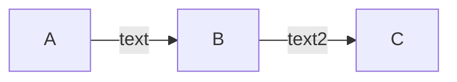

# mermaid

## 简介

[mermaid](https://mermaid-js.github.io/mermaid/#/)是一个mardown画图插件。能让你使用代码画图。包括

1. 流程图
2. 类图
3. 实体关系图
4. 。。。

值得注意的是，mermaid并不是markdown基础语法，这意味着并不是所有markdown编辑器都能渲染出来，以下列举几个能够渲染mermaid编辑器

1. typora（没收费之前我愿称其为宇宙最强md编辑器）
2. marktext（对标typora的开源md编辑器）
3. Markdown Preview Enhanced（VS Code插件）
4. markdown-preview-enhanced（Atom插件）

## 基础语法

mermaid使用的是markdown中的代码块语法，例如


````markdown

````

上述代码会渲染出如下图形


## 相关链接

1. [mermaid官网](https://mermaid-js.github.io/mermaid/#/)

2. [typora官网](https://typoraio.cn)
